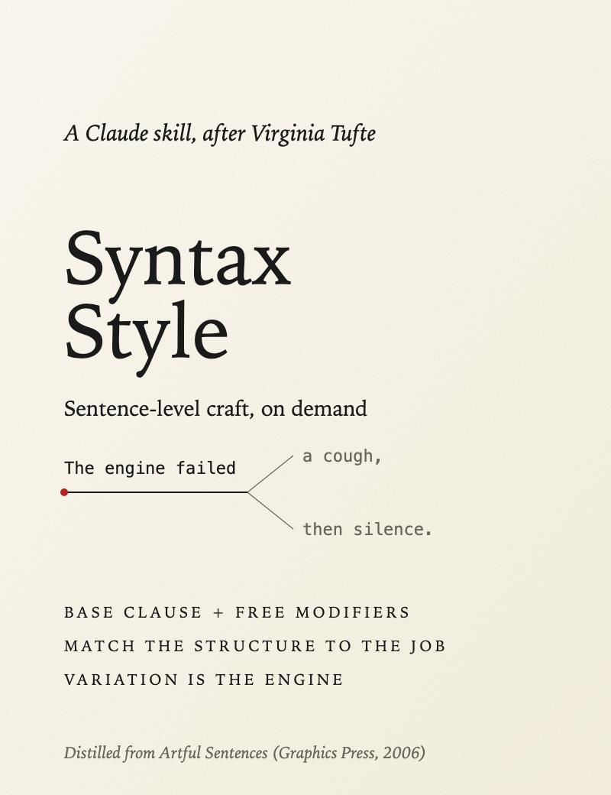
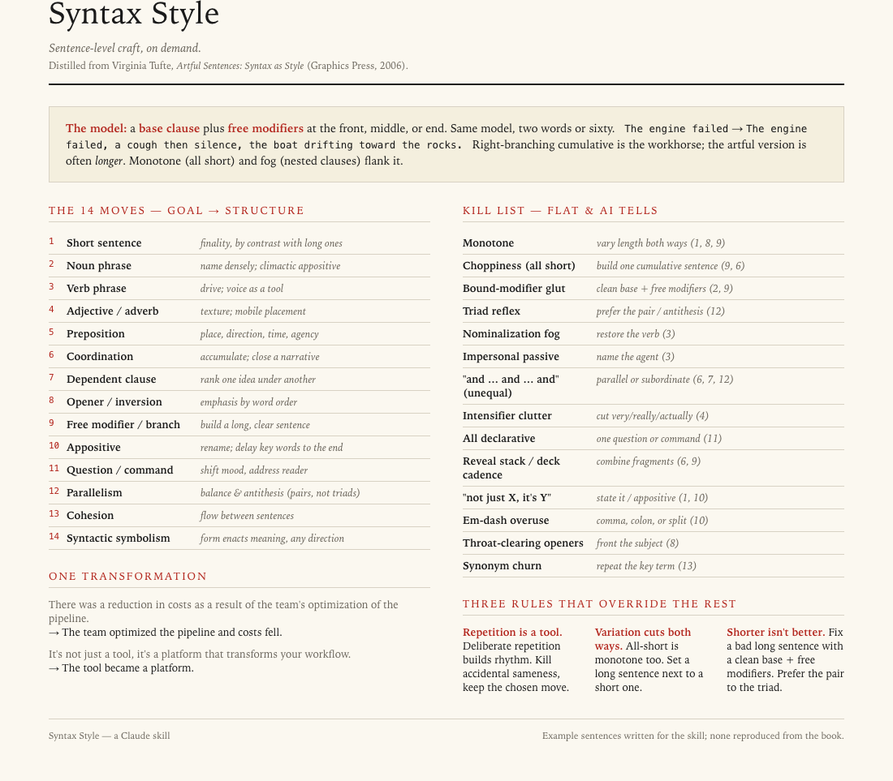
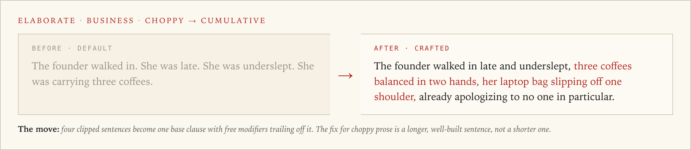
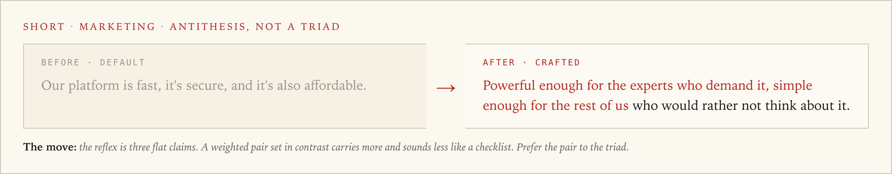
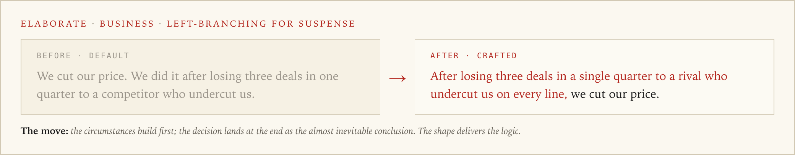
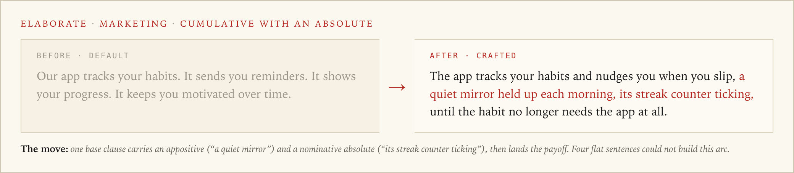
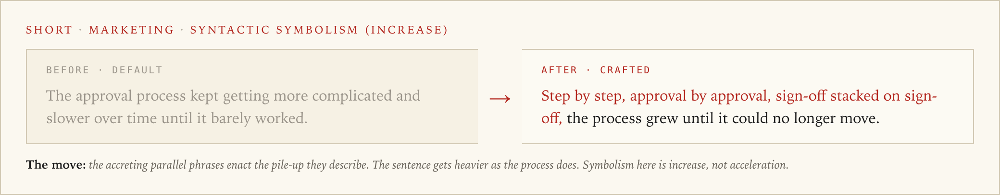
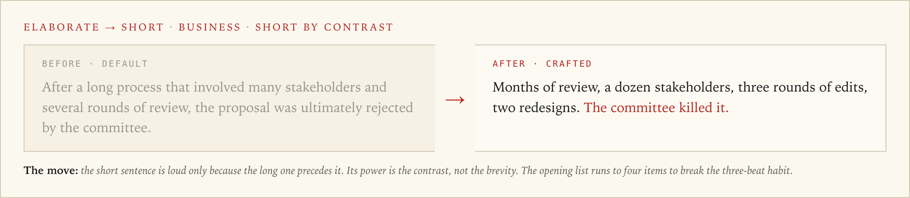

<div align="center">
  
</div>

# Syntax Style

A [Claude](https://claude.ai/code) skill for sentence-level prose craft, distilled from Virginia Tufte's *Artful Sentences: Syntax as Style* (Graphics Press, 2006).

The book's thesis is its title: the arrangement of words is not decoration on top of meaning, it is part of the meaning. A sentence's shape does work. This skill turns that idea into a small set of moves Claude can reach for on demand, plus a kill-list of the patterns that make prose read flat or machine-generated.

It is not a grammar checker and not a voice generator. It assumes the content and the voice are decided, and shapes how the words are arranged.

---

## What it does

When you ask Claude to write, tighten, or fix the rhythm of prose, this skill gives it:

- **One model** for how artful sentences are built (a base clause plus free modifiers).
- **14 named moves**, each matched to the rhetorical job it does best.
- **A kill-list** of flat and AI-sounding patterns, each paired with the structural fix.
- **A revision routine**: sentence level, then the seams between sentences, then a slop scan.

It works at two levels: the single sentence, and the flow between sentences in a paragraph.

---

## The one model

Most artful sentences are a **base clause** plus **free modifiers** attached at the front, the middle, or the end. The same model produces a two-word sentence and a sixty-word one.

```
base clause:            The engine failed.
+ end modifiers (right): The engine failed, a dull cough and then silence, the boat drifting toward the rocks.
+ front modifier (left): Two miles from shore, the engine failed.
```

Right-branching, where modifiers accumulate after a complete base clause, is the workhorse and the book's signature move. The artful version of a flat passage is often *longer*, not shorter. Two failure modes flank it: all base and no modifier is monotone (and chopping a passage into short sentences is just a different monotone), while length built from nested "which/that" clauses instead of free modifiers is fog.

---

## The principles

1. **Syntax is meaning, not packaging.** Choose a shape before you choose words.
2. **Build from a base clause, then branch.** Find the kernel, write it clean, then attach free modifiers.
3. **The long cumulative sentence is the signature move, not a failure.** A choppy passage is often best fixed by building one well-made long sentence, not by leaving it chopped.
4. **Free modifiers, not bound modifiers.** Length built from comma-set, removable modifiers reads clear; length built from nested "which/that" clauses is the real villain.
5. **Match the structure to the job.** Short for contrast, cumulative for accumulation, left-branch for suspense, coordination for a narrative close.
6. **Variation cuts both ways.** All-long is fog; all-short is monotone too. Set a genuinely long sentence next to a genuinely short one.
7. **Parallelism is balance and antithesis, not a triad reflex.** Prefer the pair. Reach for three only when three is the real number.
8. **Short sentences earn their power by contrast** with the longer ones around them, not in themselves.
9. **Form can enact meaning in any direction** — increase, attrition, suspense, fragmentation, continuity — not only acceleration.
10. **Cohesion is a full toolkit.** Known-to-new order, repeated key terms, demonstratives that carry a whole idea forward, and varied sentence length.

---

## The cheatsheet

A one-page reference: the 14 moves, the kill-list, and the two rules that override the rest.

<div align="center">
  
</div>

---

## Before and after

The "before" in each pair is not wrong. It is flat. Gray is the default an AI reaches for; red marks the move that fixes it. Notice the set does not chop everything short or resolve everything into a triad. The artful version is often the longer one.

**Choppy to cumulative** — four clipped sentences become one base clause with free modifiers trailing off it.



**Antithesis, not a triad** — a weighted pair set in contrast, instead of three flat claims.



**Left-branching for suspense** — the circumstances build first, the decision lands as the inevitable conclusion.



**Cumulative with an absolute** — one base clause carrying an appositive and a nominative absolute.



**Syntactic symbolism, increase** — the accreting phrases enact the pile-up they describe.



**Short by contrast** — the short sentence is loud only because the long one precedes it.



Four more pairs (coordination as closer, restoring the verb, cohesion, and cutting the template) are in [`before-after.md`](before-after.md).

---

## When to use it

- "Make this read better", "this is flat / robotic / monotone", "fix the rhythm"
- Editing AI-generated prose that has the tell-tale monotone (every sentence the same length and shape)
- Drafting anything where sentence craft matters: essays, posts, landing copy, emails, talk scripts, documentation

Claude triggers it automatically on those cues, or you can ask for it by name.

## How to use it

**Editing existing prose** — Claude runs the pass in [`checklist.md`](checklist.md): read for rhythm first, then fix one thing at a time, changing only the sentences doing no work.

**Drafting new prose** — write the plain version first, then reach into [`structures.md`](structures.md) for the move that matches what each key sentence is trying to do.

**Killing AI-flatness** — [`kill-list.md`](kill-list.md) names the patterns and gives the structural fix for each. The fix is always a specific move, never "add more words".

---

## What's in the skill

| File | What it holds |
|---|---|
| `SKILL.md` | Trigger and how to apply |
| `principles.md` | The ten core ideas |
| `structures.md` | The 14 moves: goal → structure, full range, sub-types, worked example |
| `kill-list.md` | Flat and AI-sounding patterns, each with its fix |
| `checklist.md` | The revision routine: sentence, paragraph, slop scan |
| `before-after.md` | Ten plain → crafted pairs, short and elaborate, business and marketing |
| `cheatsheet.html` | One-page printable reference |
| `examples/` | The source HTML and CSS that render each before/after card |

---

## Install

Clone into your Claude skills directory:

```bash
git clone https://github.com/aref-vc/syntax-style-skill.git ~/.claude/skills/syntax-style
```

Claude Code discovers it on next launch. Ask it to write or revise prose and it applies on the relevant cues.

---

## A note on the source

The technique here is attributed to Virginia Tufte's *Artful Sentences*. The book quotes roughly a thousand sentences from working writers; **none of those are reproduced in this skill.** Every example was written for the skill to illustrate a move. If the ideas are useful to you, buy the book. It is worth it.

## License

MIT. See [`LICENSE`](LICENSE).
